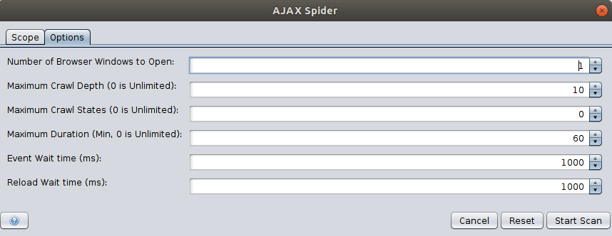
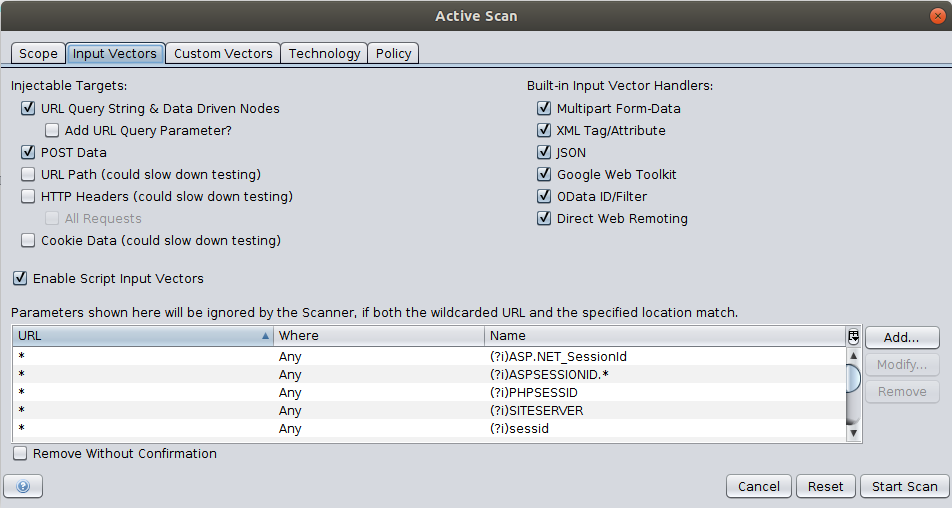
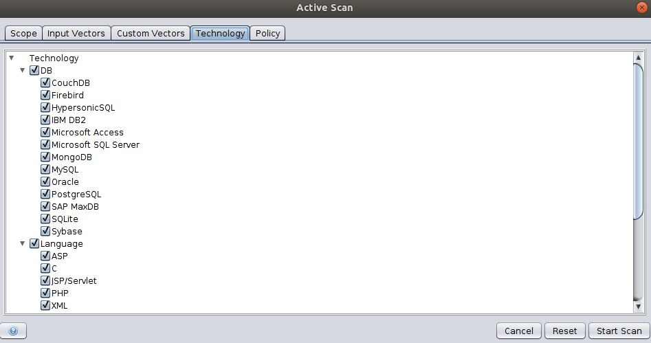
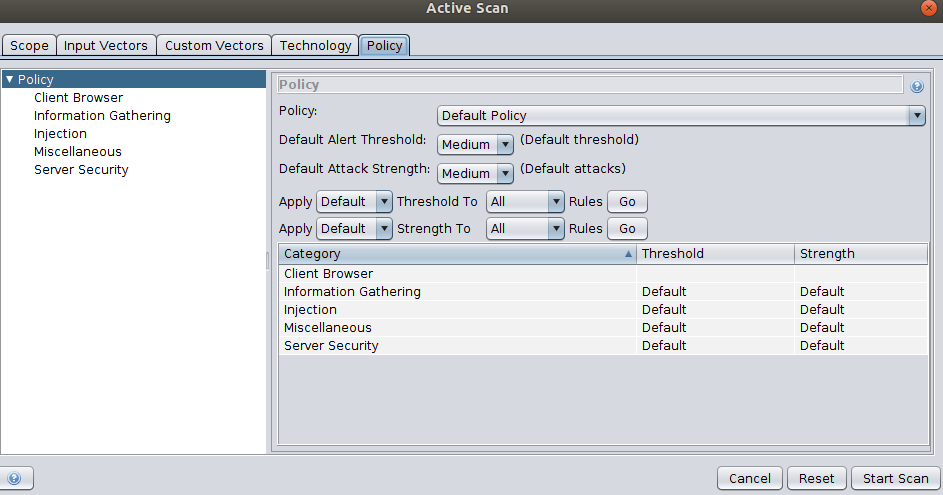

#Advanced Settings  (Content In Progress)

The following section shows some advanced configurations for ZAP's features. The examples below shows the advanced configurations
available via the desktop interface and the relevant endpoints required to perform the same via ZAP APIs.

##Spider

The following images shows the advanced configurations tab of Spider in the desktop UI.

Use the [setOptionMaxDepth](#spideractionsetoptionmaxdepth) to set the maximum depth the spider can crawl, where 0 refers unlimited depth. 
The [setOptionMaxChildren](#spideractionsetoptionmaxchildren) sets the maximum number of child nodes (per node) that can be crawled, 
where 0 means no limit. The [setOptionMaxDuration](#spideractionsetoptionmaxduration) API can be used to set the maximum duration the Spider will run.
Use the [setOptionMaxParseSizeBytes](#spideractionsetoptionmaxparsesizebytes) to limit the amount of data parsed by the spider. 
This allows the spider to skip big responses/files. 

View the [Spider section](#spider) in the API Catalogue for other additional APIs.

##Ajax Spider

The following images shows the advanced configurations tab of Ajax Spider in the desktop UI.

Similar to the Spider API, Ajax spider also provides APIs to set the [maximum depth](#) and [maximum duration](#).
Use the [event_wait_time](#) to configure the number of seconds the Ajax Spider needs to wait inorder to get a response.
Set this to a higher value if the API takes longer time to provide the results or the internet connectivity is slow.

View the [Ajax Spider section](#spider) in the API Catalogue for other additional APIs. 

##Passive Scan

The scanning rules can be enabled/disabled using the [enableScanners](#pscanactionenablescanners) and [disableScanners]((#pscanactiondisablescanners)) API.
Also use the [setScanOnlyInScope](#pscanviewscanonlyinscope) API to limit the passive scanning to a scope. View
the advanced section to learn how to configure a context or scope using ZAP APIs.

Passive scanning can also be used for automatically add tags and raise alerts for potential issues. A set of rules for 
automatic tagging are provided by default. These can be changed, deleted or added to via the Options Passive Scan Tags Screen.

View the [Passive Scan](#spider) section in the API Catalogue for additional information regarding the APIs.

##Active Scan

###General Options

The general options for Active Scan can be configured using the options tab in the desktop UI shown below.

Use the [setOptionMaxScanDurationInMins](#) to limit the duration of scan and [setOptionMaxRuleDurationInMins](#) API to limit the time of individual active scan rules.
This can be used to prevent rules that are taking an excessive amount of time.

The [setOptionHostPerScan](#) API to set the maximum number of hosts that will be scanned at the same time. 
Furthermore [setOptionThreadPerHost](#) APIs to set the number of threads the scanner will use per host. Increasing both of these values
will reduce the active scanning time but this may put extra strain on the server ZAP is running on.

Use the [setOptionDelayInMs](#) to delay each request from ZAP in milliseconds. Setting this to a non zero value will increase 
the time an active scan takes, but will put less of a strain on the target host.

View the [Active Scan](#spider) section in the API Catalogue for additional information regarding the APIs.

### Input Vectors

Input vectors refers to the elements that needs Active Scan will target. For example if you do not need ZAP to target on the
multipart from data then it should be disabled via the [input_vectors] endpoint. The active scanning time and accuracy
can be improved by specifying the exact elements to target via the input vectors.

// http://localhost:8080/UI/script/action/enable/ ?? where is this API located
Use the 
If this option is selected then the active scanner will use any enabled script input vectors. Script input vectors are scripts 
which you have written or imported into ZAP and allow you to target elements which are not supported by default.

### Technology 

The Technology tab allows you to specify which types of technologies to scan. Un-selecting technologies that you know are 
not present in the target application may speed up the scan as rules which target that technology can skip those tests.
For example if the target web application does not have a database then removing it will increase the performance of Active Scan.

// where does this API reside, context (includedTechnologyList).

### Policy

A scan policy defines exactly which rules are run as part of an active scan. It also defines how these rules run influencing 
how many requests are made and how likely potential issues are to be flagged. You can define as many scan policies as you 
like and select the most appropriate one when you start the scan via the Active Scan. 

The Policy tab shown in the above image allows you to override any of the settings specified in the selected scan policy.

