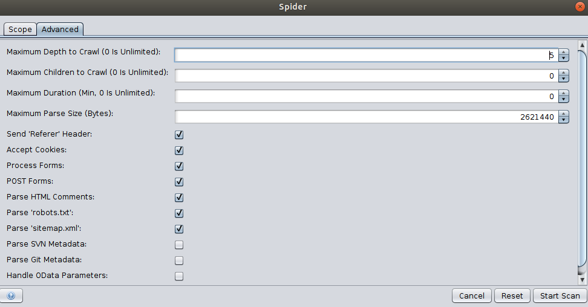

#Advanced Settings

The following are high-level examples on how to use the ZAP APIs to perform specific actions.

##Spider

Content in progress!

##Ajax Spider

Content in progress!

##Passive Scan

The scanning rules can be enabled/disabled using the [enableScanners](#pscan_enable_scan_api) and [disableScanners]((#pscan_disable_scan_api)) API.
Also use the [setScanOnlyInScope](#pscan_setScanOnlyInScope_api) API to limit the passive scanning to a scope. View
the advanced section to learn how to configure a context or scope using ZAP APIs.
Passive scanning can also be used for automatically adding tags and raising alerts for potential issues. A set of rules for 
automatic tagging are provided by default. These can be changed, deleted or added to via the Options Passive Scan Tags Screen.

##Active Scan

Content in progress!

##Context

Content in progress!

##Scope

Content in progress!

