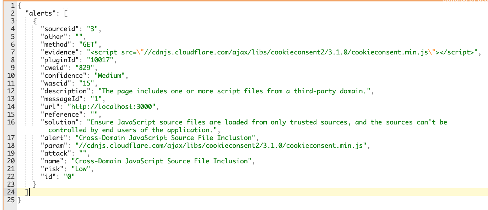

<a name="examples"></a>Examples
=========================================

The following are high level examples of how to use the ZAP APIs to perform specific actions.

<aside class="notice">
The examples shows some usages with the minimal required arguments. However, this is not a reference and not all APIs nor 
arguments are shown. View API catalogue to see all the parameters and socpe of each APIs.
</aside>

Using Spider
-------------------

The spider is a tool that is used to automatically discover new resources (URLs) on a particular site. It begins with a 
list of URLs to visit, called the seeds, which depends on how the Spider is started. The Spider then visits these URLs, 
it identifies all the hyperlinks in the page and adds them to the list of URLs to visit and the process continues recursively 
as long as new resources are found.

During the processing of an URL, the Spider makes a request to fetch the resource and then parses the response, identifying hyperlinks. 
Each response type is processed differently in ZAP.
The processing behaviours is different for different types of responses.

### Start the spider

``` shell
# Start the spider scan 
$ curl "http://localhost:8080/JSON/spider/action/scan/?apikey=zapAPIKey&zapapiformat=JSON&url=http://localhost:3000=&contextName="
```

The spider(s) explore the site. They don't actually do any scanning.
The [passive scan](#passive_scan) rules examine all of the requests and responses flowing through ZAP and report the issues they can spot.
The spider API will return the scan ID as the response. 


### View Status

``` shell
# To view the scan status
$ curl "http://localhost:8080/JSON/spider/view/status/?apikey=68u5tu85j34dc4g3ushdp847ku&scanId=<scan id>"
```

The scan is a async request.To view the scan status. 

```shell
$ curl http://localhost:8080/JSON/spider/view/results/?apikey=zapAPIKey&scanId=0
```





<a name="passive_scan"></a>Perform Passive Scan
-------------------
``` shell
$ curl 'https://zap.com/v1/coverage' -H 'Authorization: 3b036afe-0110-4202-b9ed-99718476c2e0'


HTTP/1.1 200 OK

{
    "start_production_date": "20140105",
    "status": "running",
    "shape": "POLYGON((-74.500997 40.344999,-74.500997 41.096999,-73.226 41.096999,-73.226 40.344999,-74.500997 40.344999))",
    "id": "sandbox",
    "end_production_date": "20140406"
}
```

All requests that are proxied through ZAP or initialised by tools like the spider are passively scanned. 
ZAP by default passively scans all HTTP messages (requests and responses) sent to the web application being tested. 
Passive scanning does not change the requests nor the responses in any way and is therefore safe to use.
This is good for finding problems like missing security headers or missing anti CSRF tokens but is no good for finding 
vulnerabilities like XSS which require malicious requests to be sent - thats the job of the [active scanner](#active_scan).

The (main) behaviour of the passive scanner can be configured using the Options Passive Scanner API.

Passive scanning can also be used for automatically adding tags and raising alerts for potential issues. A set of rules for 
automatic tagging are provided by default. These can be changed, deleted or added to via the Options Passive Scan Tags screen.
The alerts raised by passive scanners can be configured using the Options Passive Scan Rules screen.

The alerts for the passive scan can be obtained via issuing the following commands.

``` shell
$ curl "http://localhost:8080/JSON/core/view/alerts/?zapapiformat=JSON&apikey=68u5tu85j34dc4g3ushdp847ku&baseurl=http://localhost:3000&start=&count="
```


<a name="active_scan"></a>Perform Active Scan
-------------------

Active scanning attempts to find potential vulnerabilities by using known attacks against the selected targets.

Active scanning is an attack on those targets. You should NOT use it on web applications that you do not own.

In order to facilitate identifying ZAP traffic and Web Application Firewall exceptions, ZAP is accompanied by a script "AddZapHeader.js" which can be used to add a specific header to all traffic that passes through or originates from ZAP. eg: X-ZAP-Initiator: 3

It should be noted that active scanning can only find certain types of vulnerabilities. Logical vulnerabilities, such as broken access control, will not be found by any active or automated vulnerability scanning. Manual penetration testing should always be performed in addition to active scanning to find all types of vulnerabilities.

Perform AJAX Scan
-------------------

ZAP by default passively scans all HTTP messages (requests and responses) sent to the web application being tested. Passive scanning does not change the requests nor the responses in any way and is therefore safe to use. Scanning is performed in a background thread to ensure that it does not slow down the exploration of an application.

The (main) behaviour of the passive scanner can be configured using the Options Passive Scanner Screen.

Passive scanning can also be used for automatically adding tags and raising alerts for potential issues. A set of rules for automatic tagging are provided by default. These can be changed, deleted or added to via the Options Passive Scan Tags screen.

The alerts raised by passive scanners can be configured using the Options Passive Scan Rules screen.


Perform Authentication
-------------------

Vitae turpis massa sed elementum tempus egestas sed sed risus. Pellentesque eu tincidunt tortor aliquam nulla facilisi cras. 
Tincidunt tortor aliquam nulla facilisi cras. Tristique senectus et netus et malesuada fames. Feugiat scelerisque varius morbi enim. 
Justo eget magna fermentum iaculis eu non diam. 

