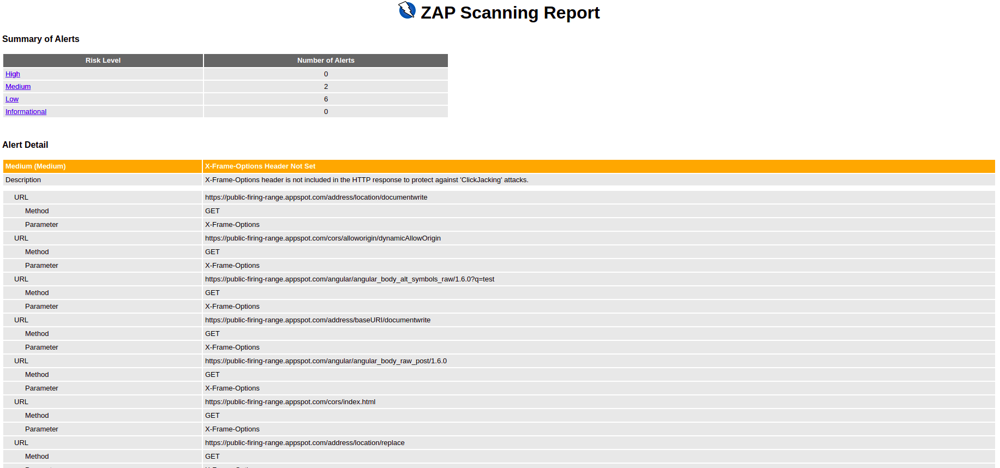

Getting The Results
=========================================

After Scanning completes, ZAP shows the result summary in the form of different categories of alerts. Basically, alerts 
are potential vulnerabilities and have been categorized as high priority, medium priority, low priority, and informational 
priority, which indicates the degree of associated risks. A high priority alert means that an issue under this category 
is more serious than other priority alerts. Likewise, medium priority alerts, low priority alerts, and informational priority 
alerts are consecutively less and less serious. Alerts categories are indicated by different colour flags. The following image shows, 
alerts flags can be seen in the bottom left of ZAP window with numbers. The number beside the flags indicate the number 
of potential issues within that category. 

The final results can be obtained in the following formats:

* HTML
* Markdown
* JSON
* XML

