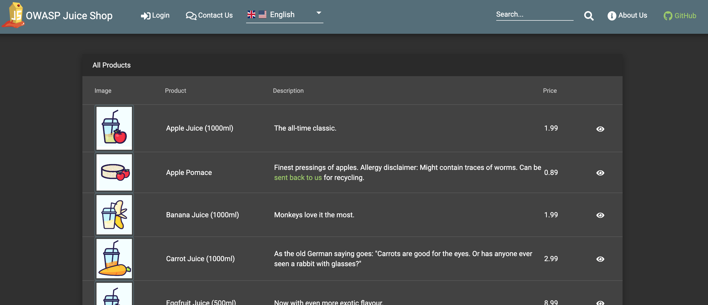

Getting Started
=====================

Overview
--------

**ZAP** is the open API for building cool stuff with mobility data.


This website documents the REST APIs for ZAP. You can view code examples in the dark area to the right; switch the 
programming language of the examples with the tabs in the top right. If anything is missing or seems incorrect, 
please check the GitHub issues for existing known issues or create a new issue.


ZAP provides the following features:

* Intercepting Proxy
* Automated Scanner
* Passive Scanner
* Brute Force Scanner
* Fuzzer
* Port Scanner
* Spider
* Web Sockets
* REST API

Have a look at the examples below to learn how to use them.

Quick Setup Guide
---------------

### Basic penetration test

All requests that are proxied through ZAP or initialised by tools like the spider are [passively scanned:](https://github.com/zaproxy/zap-core-help/wiki/HelpStartConceptsPscan)
**(In progress, This hyper link will be linked to the auto generated API catalogue)**. Passive scanning is always performed because it is completely safe - ZAP just looks at the requests and responses rather 
than making any additional requests. This is good for finding problems like missing security headers or missing anti CSRF 
tokens but is no good for finding vulnerabilities like XSS which require malicious requests to be sent - thats the job of 
the active scanner.

The quick start guide focuses on setting up _ZAP_ and perform a passive security scan. Jump to specific example if you 
want to experiment with specific features.

<aside class="notice">
This chapter shows some usages with the minimal required arguments. However, this is not a reference and not all APIs nor 
arguments are shown. View API catalogue to see all the parameters and socpe of each APIs.
</aside>

<aside class="warning">
Do not use on unauthorized pages. Use ZAP on a website only if you have permissions to perform testing on it!
</aside>

Setup OWASP ZAP
---------------
> 2 ways to start zap

``` shell
# Option: 1, using "headless" mode
$ <ZAP_HOME>./zap.sh -daemon -config api.key=change-me-9203935709
# Option: 2, using normal mode
$ <ZAP_HOME>./zap.sh
```

Go to the ZAP [home page](https://github.com/zaproxy/zaproxy/wiki/Downloads) and download the installer specific to the operating system.

After extracting the bundle you can start zap by issuing the following command.

The API key must be specified on all API 'actions' and some 'other' operations. The API key is used to prevent malicious sites from accessing the ZAP API. It is strongly recommended that you set a key unless you are using ZAP in a completely isolated environment.

<aside class="notice">
ZAP requires Java to run.
</aside>

Configure Testing Application
---------------

```
$ git clone https://github.com/bkimminich/juice-shop.git
$ cd juice-shop 
$ npm install
$ npm start
```

If you have a website to scan then obtain a publicly accessible URL/IP. For quick start guide we will be using OWASP Juice shop.


OWASP Juice Shop is probably the most modern and sophisticated insecure web application! It can be used in security trainings, 
awareness demos, CTFs and as a guinea pig for security tools! Juice Shop encompasses vulnerabilities from the entire OWASP Top Ten 
along with many other security flaws found in real-world applications!

Set up Juice shop with the following commands in the right column. Then visit `http://localhost:3000` to access the OWASP Juice shop.





Getting help
------------

All available functions are documented in [API Catalogue](#interface)

A developer mailing list is available to ask questions or feature request: <a href="mailto:https://groups.google.com/d/forum/zaproxy-develop">https://groups.google.com/d/forum/zaproxy-develop</a>

In order to report bug and make feature requests please use our github zap project
<https://github.com/zaproxy/zaproxy/issues>.

Stay tuned on twitter [@zaproxy](https://twitter.com/zaproxy).
